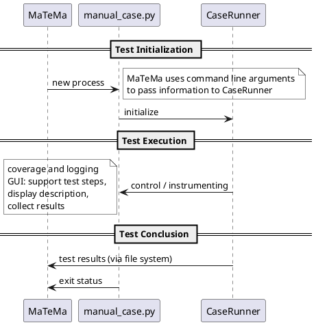

<!--Copyright 2026 the contributors of APPXF (github.com/alexander-nbg/appxf)-->
<!--SPDX-License-Identifier: 0BSD-->
The CaseRunner is used within your manual test case to operate with the MaTeMa. The following outlines the interactions.

* **Initialization**: The MaTeMa uses the ***command line arguments*** to pass information to the CaseRunner. This includes details on how to pass test execution details *back* to the MaTeMa.
* **Test Execution**: The CaseRunner supports manual test case execution in various ways, see the usage patterns below.
* **Test Conclusion**: The CaseRunner collects results from the execution and passes it back to the MaTeMa.

# General Remarks
* ***Limitation***: The manual test must not use command line arguments. Since the MaTeMa and the CaseRunner itself uses this interface for test control, inconsistencies can lead to unexpected behavior.
* ***Limitation***: The CaseRunner typically controls logging and coverage collection such that you test script should not also try to control those details.
* ***Limitation***: If the test case generates a tkinter.Tk instance, it must pass it via `CaseRunner(parent=...)`. Exceptions are Tk instances confined in any `test()` or `process_*()` which will run in their own process.
* *Remark*: The naming convention `manual_*.py` is only required for the MaTeMa, the CaseRunner can also be used without this constraint.
# Use Case: no change to existing test cases
While not being recommended, you can instrument existing test cases for MaTeMa by just adding an initialization of the CaseRunner to enable the usage with the MaTeMa and minimal support.
```python
from appxf_metama import CaseRunner

# preparation steps for your test case

CaseRunner()

# your test case implementation
```
Remarks:
* Since CaseRunner() activates the coverage recording, you should place it where the actual test case execution begins.
* The overhead to your existing manual test case comprises: loading additional dependencies and checking whether there are command line arguments via CaseRunner().
* You can put the test case description in the modules docstring like shown in the "Single Instance" use case.

#TODO The CaseRunner currently does not restrict it's actions to just command line reading. There is no feature to ***not*** start the file parsing. The examples already draft expected behavior.
# Use Case: Single Instance
Split `startup()` and `teardown()` code. This has two effects:
* this code is not increasing your coverage, the case runner will start coverage only for the execution of `test()`
* because of the above, you limit the file dependencies to the test case and avoid marking the case invalid due to changes in the corresponding files
```python
'''
Test case __description__ that can apply mardown.
'''
from appxf_metama import CaseRunner

# construct any objects you need

def setup():
	# any preparations before test execution

def teardown():
	# any steps after test execution

def test():
	# implementation of your test case

CaseRunner().run()
```
Remarks:
* The functions `setup()` and `teardown()` are executed before and after any call of `test()` or `process_*()`. Without `test()` or `process_*()`, they have no effect.
* The run() is required.
* #TODO adding capabilities for `test_*()`would be nice and enable putting multiple test cases within one file `manual_*.py` like for pytest.
# Use Case: Launching Processes
Using `process_*()` functions will result in action buttons within the CaseRunner GUI. The buttons use the functions summary as labels and execute within a *new process* that loads your manual test case module.
```python
def process_app_admin():
	''' Admin Application '''

def process_app_user():
	''' User Application '''
```
This pattern can apply in following situations:
* testing interactions between ***multiple instances of an application***
* being able to close and ***reopen your instance*** during testing
* adding ***automated sandbox actions*** like reset
	* ***not*** for automated actions within your running instance - that's not possible because it runs within it's own process
# Use Case: Sandboxed Instances
Applications often have a persisted state on the file system (or on a server), referenced as sandbox. To prepare and tear down this sandbox, use the following hooks:
```python
def setup_once():
	# sandbox preparation executed ONCE before any setup()

def teardown_once():
	# sandbox teardown executed ONCE before the case runner
	# closes and after any teardown()
```
# Reference Sequences
The following reference sequence is still an outline but hopefully clarifies any open questions concerning the order of execution.

1. Execute your module until CaseRunner()
	1. if you called from CLI without arguments, nothing else happens
	2. if MaTeMa or CaseRunner called it - behavior is defined elsewhere
		1. Even if MaTeMa calls the test case, nothing else will be activated. Use run() if you want more. <<<< TBD !!!!!!!!!!!!!!!!!!!
	3. if you called from CLI with arguments: undefined behavior - most likely, you see output from the argument parser.
2. Execute code until run()
	1. If there is no run(), nothing more than above will happen
	2. The CaseRunner takes over responsibilities: see next steps
3. CaseRunner parses the module
4. CaseRunner GUI is initialized
	1. This incluces adding the buttons from any `process_()` function in your test case
5. CaseRunner executes `setup_once()`
6. CaseRunner initializes the test
	1. Run `setup()`
	2. Ensure logging and coverage is active
	3. If existing, execute `test()`
7. CaseRunner GUI waits for test conclusion
	1. May spawn any `process_*()`
8. CaseRunner concludes the test
	1. stop coverage (but not logging)
	2. run `teardown()` and `teardown_once()` (in this order)
	3. if called from MaTeMa, writing test case result
9. Execute your module with anything after `run()`
