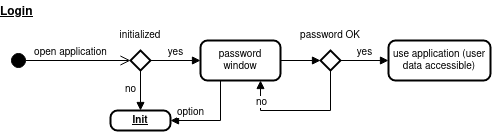
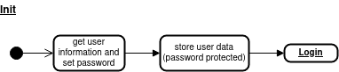

# Security

Your application likely stores sensible data like passwords to servers or details on other persons. A **login** procedure allows to encrypt the locally stored data. You thereby do not depend on the password protection of the operating system and stolen data cannot be used. A **registration** procedure can ensure that only authorized users get access to servers. For example can you verify the requested user role and you can provide server passwords as part of the registration process.

Usage can be as simple as the following. Note that login and registration both requiere a toolbox configuration object (see TBD):

```python
from ooTool import config,login, registration

config = Config()
# Optionally, there can be more code to specify user data you want to 
# collect on initialization.

login.check(config)
# After this step, the configuration has loaded the user data.

registration.check(config)
# After this step, the configuration has verified the registration.

# login and registration above will both terminate the application if the 
# step is not passed. Hence, you can safely continue your main application 
# here.
```

## Login

Dropping images:





