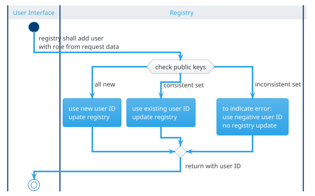

<!--Copyright 2026 the contributors of APPXF (github.com/alexander-rd/appxf)-->
<!--SPDX-License-Identifier: 0BSD-->
? this diagram sounds technical (calling registry)

# Checking Public Keys
The registry stores the public signing key and the public encryption keys which also serve as an identification. **They must be unique**. Hence, if any of the signing or encryption keys already exists, a new user **must not** be added. There are two cases:
* the keys are consistent:
	* eventually new user data will be updated
* one key already exists but the other key(s) for the user entry is inconsistent to the keys from the request
	* a negative user ID is returned to indicate an error (fail operational)
# Alternatives
## Inconsistent Keys
An alternative to returning a negative user ID would be to raise an error. Consequences:
* try/catch in calling user interface
	* fair enough to demand a safe integration
* which error class to use?
Error class options:
* a custom error class to allow precise filtering within try/catch?
	* (-) added complexity even if APPXF custom error classes are commonly used
* an existing error class
	* (-) not possible to filter for this situation in UI
The negative user ID is preferred since it makes this particular error transparent without adding a specific error code.