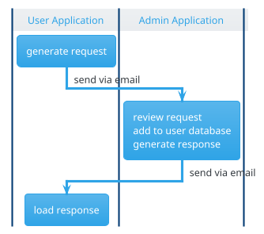

**Situation.** You want to work together with others in an application and exchange data securely. How do you set up the initial communication?

The **registration** procedure *initializes* the [[User Registry]] to enable [[Data Synchronization]]. The procedure requires an admin instance and the user instance that wants to register. It comprises three top-level steps.

1. User generates a registration request file
	* contains user information (see [[Login for Local Encryption]]) including the user public keys
	* data is encrypted with admin public key
	* sent to admin, typically via email
2. Admin reviews the registration request, updates the user database and generates a registration response file
	 * user roles are set during review
	 * response may include sections of the [[Configuration]] - at least the credentials for the shared storage are required
	 * response is encrypted by users public key
	 * sent back to user, typically via email
 3. User loads the registration response
 Not highlighted is the synchronization of the [[User Registry]] and other files via remote storage [[Data Synchronization]].
