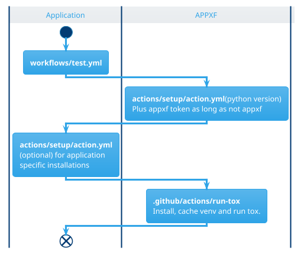

<!--Copyright 2026 the contributors of APPXF (github.com/alexander-nbg/appxf)-->
<!--SPDX-License-Identifier: 0BSD-->
# Testing

## Current Setup
* Entry point: **.github/workflows/test.yml**
	* Calls: **appxf/github/test**@main (os, python version)
		* checkout repo
		* checkout appxf (if not running on appxf)
		* Calls: **./.github/actions/setup** (only if on appxf)
		* Calls: **appxf/.github/actions/setup** (if not on appxf)
		* install appxf
		* tox preparation
		* run tox (if not appxf) << wrong

# TODO:
* User RUNNER_OS instead of passing the os as argument.