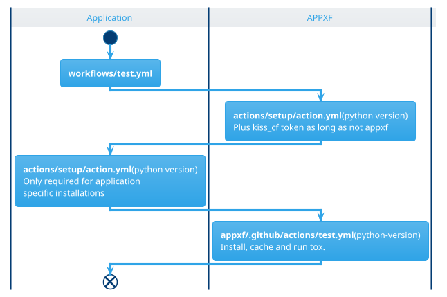

# Testing

## Current Setup
* Entry point: **.github/workflows/test.yml**
	* Calls: **kiss_cf/github/test**@main (os, python version)
		* checkout repo
		* checkout kiss_cf (if not running on kiss_cf)
		* Calls: **./.github/actions/setup** (only if on kiss_cf)
		* Calls: **kiss_cf/.github/actions/setup** (if not on kiss_cf)
		* install kiss_cf
		* tox preparation
		* run tox (if not kiss_cf) << wrong

# TODO:
* User RUNNER_OS instead of passing the os as argument.